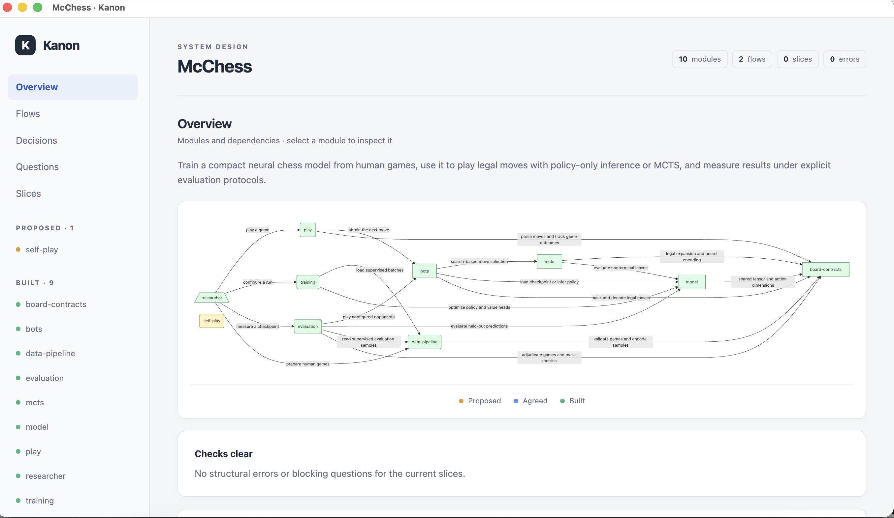

# Kanon

**Build in the terminal. Watch your system take shape.**

Invoke Kanon in Codex or Claude Code, put the live architecture map on your second
screen, and keep building. Your coding agent maintains the design as it works, and
the graph updates automatically.



*McChess in Kanon: modules, dependencies, and what's proposed or built.*

## Get started

Requires Node.js 20 or newer. Clone Kanon:

```sh
git clone https://github.com/MecGlandorff/Kanon.git
```

[Set up Kanon for Codex or Claude Code](docs/reference.md#install-and-run),
then ask your agent from the project you're working on:

> Use Kanon for this project. Open the live map and keep it current as we build.

[Full reference](docs/reference.md)
